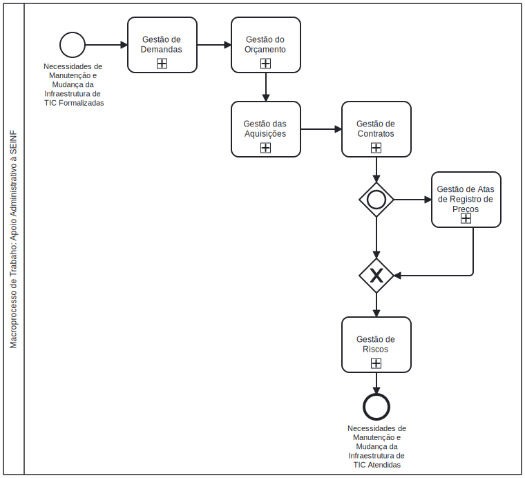

<table align="right" border="0">
  <tr>
    <td align="center" valign="top">
      <a href="https://github.com/dnlclaudino/gestao-do-conhecimento#readme">
         Início da  Gestão do  Conhecimento
      </a>
    </td>
    <td align="center" valign="top">
      <a href="https://github.com/dnlclaudino/tre-pb-seinf-proc-trab-adm#readme">
         Início deste  Repositório
      </a>
    </td>
    <td align="center" valign="top">
      <a href="">
         Baixar em PDF
      </a>
    </td>
  </tr>
</table>      

# Macroprocessos de Trabalho: Apoiar Administrativamente à SEINF

Este repositório contém a gestão do conhecimento dos **processos de trabalho administrativos** para realização Das **atribuições regulamentares**, conforme Resolução TRE-PB nº 14/2019, art. 89.

|#|Macroprocesso de trabalho|
|:---:|:---|
|1|[Gestão de Demandas](./gestao-de-demandas/README.md)|
|2|[Governança e Gestão da Estratégia](./governanca-e-gestao-estrategica/README.md)|
|3|[Gestão do Orçamento](./gestao-do-orcamento/README.md)|
|4|[Gestão de Contratações](./gestao-de-contratacoes/README.md)|
|5|[Gestão de Contratos](./gestao-de-contratos/README.md)|
|6|[Gestão de Atas de Registro de Preços(ARPs)](./gestao-de-arps/README.md)|
|7|[Gestão de Riscos](./gestao-de-riscos/README.md)|
|8|[Gestão do Patrimônio](./gestao-do-patrimonio/README.md)|
|9|Gestão de Integridade|
|10|Gestão Documental e da Memória|
|11|[Gestão de Processos de Trabalho](./gestao-de-processos-de-trabalho/README.md)|

### Visão Geral do Apoio Administrativo à SEINF

Todas as atribuições regulamentares da SEINF, dispostas na Resolução TRE-PB nº 14/2019, art. 89, demandam apoio administrativo de acordo com a seguinte visão geral, num nível de mais alto grau de abstração:

## Navegação nos arquivos deste repositório

Em todos os arquivos deste repositório, serão disponibilizados os ícones abaixo, no ínício e canto superior direito de cada arquivo, para uma navegação básica para **página inicial da fonte** e para **página inicial da minha gestão do conhecimento**. Após a conclusão da redação de cada arquivo deste repositório, o ícone **Baixar em PDF** apontará para o arquivo PDF que será gerado possibilitando obter o conteúdo também no formato PDF.

<table align="right" border="0">
  <tr>
    <td align="center" valign="top">
      <a href="https://github.com/dnlclaudino/gestao-do-conhecimento#readme">
         Início da  Gestão do  Conhecimento
      </a>
    </td>
    <td align="center" valign="top">
      <a href="https://github.com/dnlclaudino/tre-pb-seinf-proc-trab-adm#readme">
         Início deste  Repositório
      </a>
    </td>
    <td align="center" valign="top">
      <a href="">
         Baixar em PDF
      </a>
    </td>
  </tr>
</table>     

## Relação das Competências Desenvolvidas

O estudo de todas as fontes desse repositório permitiram o desenvolvimento das seguintes competências:

### Competência Profissionais | Categoria | Descrição breve da competência

- **Código**: CPT-SEINF-PTADM-A001

|**Verbo**|**Objeto**|**Condição**|**Critério**|
|:---|:---|:---|:---|
|Verbo|Objeto|Condição|Critério|

|**Conhecimentos**|**Habilidades**|**Atitudes**|
|:---|:---|:---|
|-|-|-|

Para mais informações, acesse minha [Gestão de Competências](https://github.com/dnlclaudino/gestao-de-competencias/tree/master)

## Versão da Política de Gestão do Conhecimento

A versão da [Política de Gestão do Conhecimento](https://github.com/dnlclaudino/gestao-do-conhecimento/tree/master) utilizada é **v0.0.1**. As regras para realização de **commits** estão disponíveis em [Regras para commits no Github](https://github.com/dnlclaudino/gestao-do-conhecimento/blob/master/README.md#regras-para-nomenclatura-de-commits-no-github)

## Licença

Este material está sob licença especificada no arquivo [LICENCE](./LICENSE). Esta licença permite que outros remixem, adaptem e criem a partir do seu trabalho para **fins não comerciais**, DESDE QUE **atribuam o devido crédito ao autor (Daniel Claudino)** e que licenciem as **novas criações** sob **termos idênticos**.

 A <b>Gestão do Conhecimento</b> de <a xmlns:cc="http://creativecommons.org/ns#" href="https://github.com/dnlclaudino/gestao-do-conhecimento" property="cc:attributionName" rel="cc:attributionURL">Daniel Claudino</a> está licenciado com uma Licença <a rel="license" href="http://creativecommons.org/licenses/by-nc/4.0/">Creative Commons - Atribuição-NãoComercial 4.0 Internacional</a>.  

## Referências Bibliográficas

As referências bibliográficas das fontes deste repositório encontram-se no [Repositório Central de Referências Bibliográficas](https://github.com/dnlclaudino/repositorio-central-referencias-bibliograficas/tree/master).
