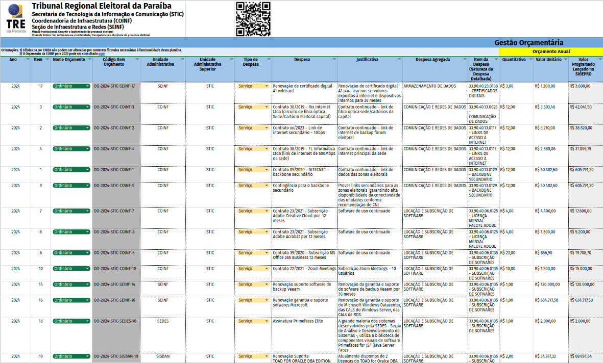

### COINF/SEINF

# Gestão das Aquisições 2024

### Janeiro de 2024

---

# Gestão das Aquisições 2024

---

ÁREA DE CONFIGURAÇÃO DE EQUIPAMENTOS #1

---

---

---

# Gestão das Aquisições na SEINF

Obrigado !!!

