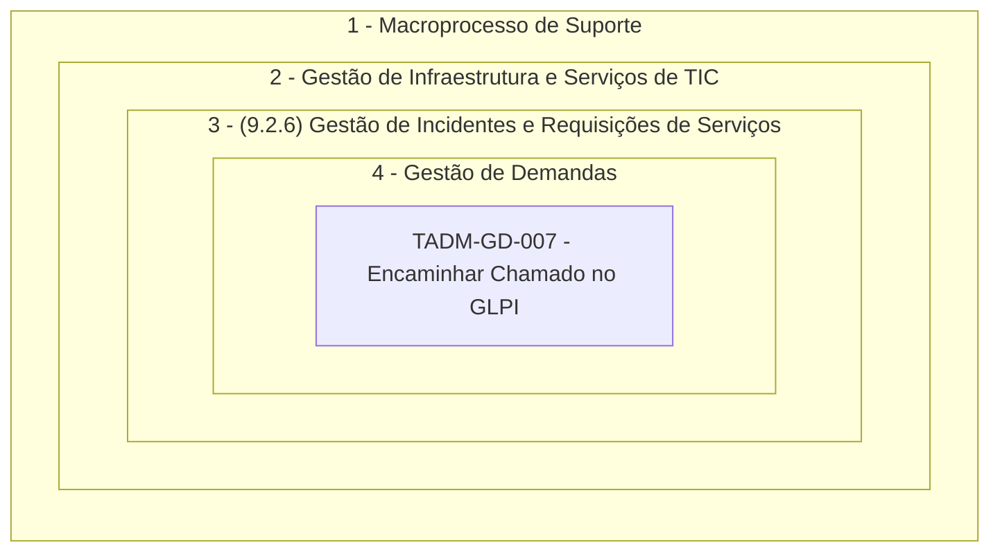

<table align="right" border="0">
  <tr>
    <td align="center" valign="top">
      <a href="https://github.com/dnlclaudino/gestao-do-conhecimento#readme">
         Início da  Gestão do  Conhecimento
      </a>
    </td>
    <td align="center" valign="top">
      <a href="https://github.com/dnlclaudino/tre-pb-seinf-proc-trab-adm#readme">
         Início deste  Repositório
      </a>
    </td>
    <td align="center" valign="top">
      <a href="https://github.com/dnlclaudino/tre-pb-seinf-proc-trab-adm#readme">
         Baixar em PDF
      </a>
    </td>
  </tr>
</table>     

  

# Processo de Trabalho: ADM-GD-007 - Encaminhar Chamado no GLPI

## 1. Identificação do Processo

- **Nome do Processo**:
- **Objetivo do Processo**:
- **Leis e normas aplicáveis ao processo**: [(Clique aqui)](https://github.com/dnlclaudino/tre-pb-seinf-proc-trab-adm/blob/main/gestao-de-demandas/README.md#normas-relacionadas-com-a-gest%C3%A3o-de-demandas)
- **Unidade de gestão do processo**:
- **Áreas envolvidas**:
- **Unidade de mapeamento do processo**:
- **Tipo do Processo, Especificação e Classificação por Assuntos – Sistema SEI**
  - Tipo de processo:
  - Especificação:
  - Classificação por Assuntos:

## 2. Delimitação do Processo

### 2.1 Evento Inicial

- (...)

### 2.2 Resultado

- (...)

### 2.3 Fornecedor(es)

- (...)

### 2.4. entradas / Insumos

- (...)

### 2.5 Clientes

- (...)

### 2.6 Saídas / Produtos

- (...)

## 3. Etapas / Atividades do Processo:

|#|Etapa/Entrega/Atividade|Responsável/Unidade Responsável|Prazo / Condição|
|:---:|:---|:---|:---|
|1|-|-|-

## 4. Identificação de Oportunidade de Melhorias

|#|Problemas/dificuldades/gargalo|Ideias de melhorias|
|:---:|:---|:---|
|1|-|-|

##### Orientações

- **Problemas/dificuldades/gargalo**: Problemas e dificuldades eventualmente detectados no processo, no âmbito da
unidade no qual o mesmo está sendo mapeado;
- **Ideias de melhorias**: possíveis soluções de melhoria aos problemas e dificuldades eventualmente
encontrados no processo

## 5. Modelagem do Processo ( Mapa do Processo )

- Incluir imagem do BPMN do processo;
- Incluir link para o arquivo ".bpmn";

## Metodologia

- [Metodologia de Gestão de Processos do TRE-PB](https://www.tre-pb.jus.br/++theme++justica_eleitoral/pdfjs/web/viewer.html?file=https://www.tre-pb.jus.br/transparencia-e-prestacao-de-contas/planejamento-e-gestao/gestao-de-processos/arquivos/trepb-metodologia-de-gestao-de-processos/@@download/file/trepb-metodologia-de-gestao-de-processos.pdf)
- [Guia Prático de Gestão de Processos do TRE_PB](https://www.tre-pb.jus.br/++theme++justica_eleitoral/pdfjs/web/viewer.html?file=https://www.tre-pb.jus.br/transparencia-e-prestacao-de-contas/planejamento-e-gestao/gestao-de-processos/arquivos/trepb-guia-pratico-de-gestao-de-processos/@@download/file/trepb-guia-pratico-de-gestao-de-processos.pdf)
  - Formulário de Mapeamento de Processo: Páginas 22 a 26
