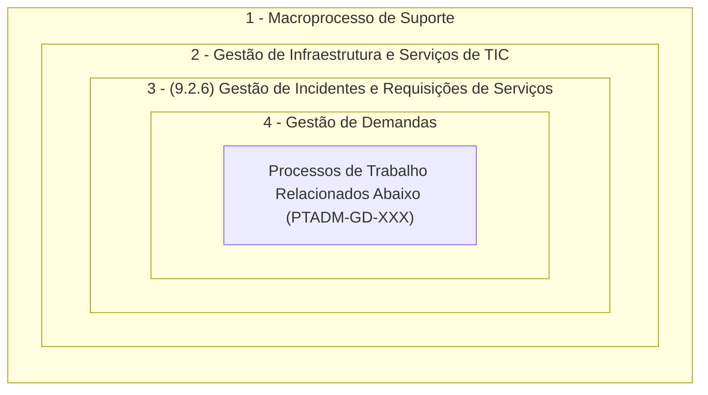

<table align="right" border="0">
  <tr>
    <td align="center" valign="top">
      <a href="https://github.com/dnlclaudino/gestao-do-conhecimento#readme">
         Início da  Gestão do  Conhecimento
      </a>
    </td>
    <td align="center" valign="top">
      <a href="https://github.com/dnlclaudino/tre-pb-seinf-proc-trab-adm#readme">
         Início deste  Repositório
      </a>
    </td>
    <td align="center" valign="top">
      <a href="https://github.com/dnlclaudino/tre-pb-seinf-proc-trab-adm#readme">
         Baixar em PDF
      </a>
    </td>
  </tr>
</table>     

# Gestão de Demandas

Em observância à **cadeia de valor** e à **arquiterura de processos** do TRE-PB, nos termos da [Portaria nº 32/2022](https://www.tre-pb.jus.br/++theme++justica_eleitoral/pdfjs/web/viewer.html?file=https://www.tre-pb.jus.br/transparencia-e-prestacao-de-contas/planejamento-e-gestao/gestao-de-processos/arquivos/trepb-cadeia-de-valor/@@download/file/tre-pb-cadeia-de-valor.pdf):

| Código do Processo de trabalho | Nome do Processo de Trabalho | Evento Inicial | Evento Final | Anotações |
|:---:|:---|:---|:---|:---:|
|PTADM-GD-001|Identificar Demandas em Processos SEI|-|-|-|
|PTADM-GD-002|Identificar Demandas em E-mail da Unidade|-|-|-|
|PTADM-GD-003|Identificar Demandas Informal/Verbal|-|-|-|
|PTADM-GD-004|Monitorar Carga de Trabalho de Colaboradores|-|-|-|
|PTADM-GD-005|Atribuir Demanda a Colaborador|-|-|-|
|PTADM-GD-006|[Atender Chamado no GLPI](./PTADM-GD-006.md)|-|-|-|
|PTADM-GD-007|[Encaminhar Chamado no GLPI](./PTADM-GD-007.md)|-|-|-|
|PTADM-GD-008|[Tratar Chamado no GLPI](./PTADM-GD-008.md)|-|-|-|

## Normas Relacionadas com a Gestão de Demandas

|Norma|Ementa|
|:---|:---|
|[Resolução TSE nº 23.387/2012](https://www.tse.jus.br/legislacao/compilada/res/2012/resolucao-no-23-387-de-4-de-outubro-de-2012) | **Uso da rede corporativa** de comunicação de dados na Justiça Eleitoral|
|[Instrução Normativa TRE-PB nº 1/2019](https://apps.tre-pb.jus.br/normas-portal/doc?tipo=norma&cod=1301&nom=TRE-PB-instru%C3%A7%C3%A3o-normativa-1-2019.pdf) | Política de **cópia de segurança das informações** mantidas em **meios digitais**|
|[Portaria TRE-PB nº 360/2019](https://apps.tre-pb.jus.br/normas-portal/doc?tipo=norma&cod=1504&nom=TRE-PB-portaria-ptre-360-2019.pdf) | Política de **Controle de Acesso Lógico**|
|[Resolução TRE-PB nº 2/2019](https://apps.tre-pb.jus.br/normas-portal/doc?tipo=norma&cod=1264&nom=TRE-PB-resolu%C3%A7%C3%A3o-2-2019.pdf) | **Classificação da informação** quanto à **CONFIDENCIALIDADE**|
|[Portaria TRE-PB nº 62/2020](https://apps.tre-pb.jus.br/normas-portal/doc?tipo=norma&cod=1414&nom=TRE-PB-portaria-ptre-62-2020.pdf) | Política de utilização do **serviço de correio eletrônico**|
|[Portaria TRE-PB n° 63/2020](https://apps.tre-pb.jus.br/normas-portal/doc?tipo=norma&cod=1420&nom=TRE-PB-portaria-ptre-63-2020.pdf) | Política de **acesso à internet**|
|[Portaria TRE-PB n° 87/2020](https://apps.tre-pb.jus.br/normas-portal/doc?tipo=norma&cod=1443&nom=TRE-PB-portaria-ptre-87-2020.pdf) | **Uso de recursos** de tecnologia da informação e comunicação|
|[Instrução Normativa TRE-PB nº 2/2021](https://apps.tre-pb.jus.br/normas-portal/doc?tipo=norma&cod=1592&nom=TRE-PB-in-2-2021.pdf) | Política de **GESTÃO DE VULNERABILIDADES** em Ativos de Informação|
|[Resolução TSE nº 23.644/2021](https://www.tse.jus.br/legislacao/compilada/res/2021/resolucao-no-23-644-de-1o-de-julho-de-2021) | **Política de Segurança da Informação** (PSI) da Justiça Eleitoral|
|[Resolução TSE nº 23.650/2021](https://www.tse.jus.br/legislacao/compilada/res/2021/resolucao-no-23-650-de-9-de-setembro-de-2021)|Política de **Privacidade e Proteção de Dados** Pessoais da Justiça Eleitoral|
|[Portaria TRE-PB n° 104/2022](https://apps.tre-pb.jus.br/normas-portal/doc?tipo=norma&cod=1644&nom=TRE-PB-portaria-ptre-aspre-104-2022.pdf)| **Controle de Acesso Físico** relativo à segurança das informações e comunicações|
|[Instrução Normativa nº 4/2022](https://apps.tre-pb.jus.br/normas-portal/doc?tipo=norma&cod=1632&nom=TRE-PB-in-4-2022.pdf) | Gerenciamento e monitoramento de **LOGS** (registros digitais) no ambiente| computacional|
|[Instrução Normativa nº 6/2022](https://apps.tre-pb.jus.br/normas-portal/doc?tipo=norma&cod=1680&nom=TRE-PB-instrucao-normativa-ptre-6-2022.pdf) | **CONFIGURAÇÃO SEGURA DE ATIVOS** de TIC|
|[Portaria TRE-PB nº XX/2023](https://sei.tre-pb.jus.br/sei/controlador.php?acao=procedimento_trabalhar&id_procedimento=1719621&id_documento=1754387)|Dispõe sobre a **Central de Serviços** de Tecnologia da Informação e Comunicação no Tribunal Regional Eleitoral da Paraíba|
|[Resolução TRE-PB nº 12/2023](https://apps.tre-pb.jus.br/normas-portal/doc?tipo=norma&cod=1817&nom=TRE-PB-resolucao-12-2023.pdf)|**CÓDIGO DE ÉTICA** dos Servidores e das Servidoras do TRE-PB|
|[Portaria TRE-PB/PTRE nº 280/2023](https://apps.tre-pb.jus.br/normas-portal/doc?tipo=norma&cod=1877&nom=tre-pb-portaria-280-2023.pdf)|**TERMO DE RESPONSABILIDADE E CONFIDENCIALIDADE** das Informações e a Declaração de Ciência nas contratações de serviços e nos estágios |

## Licença

Este material está sob licença especificada no arquivo [LICENCE](../LICENSE). Esta licença permite que outros remixem, adaptem e criem a partir do seu trabalho para **fins não comerciais**, DESDE QUE **atribuam o devido crédito ao autor (Daniel Claudino)** e que licenciem as **novas criações** sob **termos idênticos**.

 A <b>Gestão do Conhecimento</b> de <a xmlns:cc="http://creativecommons.org/ns#" href="https://github.com/dnlclaudino/gestao-do-conhecimento" property="cc:attributionName" rel="cc:attributionURL">Daniel Claudino</a> está licenciado com uma Licença <a rel="license" href="http://creativecommons.org/licenses/by-nc/4.0/">Creative Commons - Atribuição-NãoComercial 4.0 Internacional</a>.

## Outras Referências